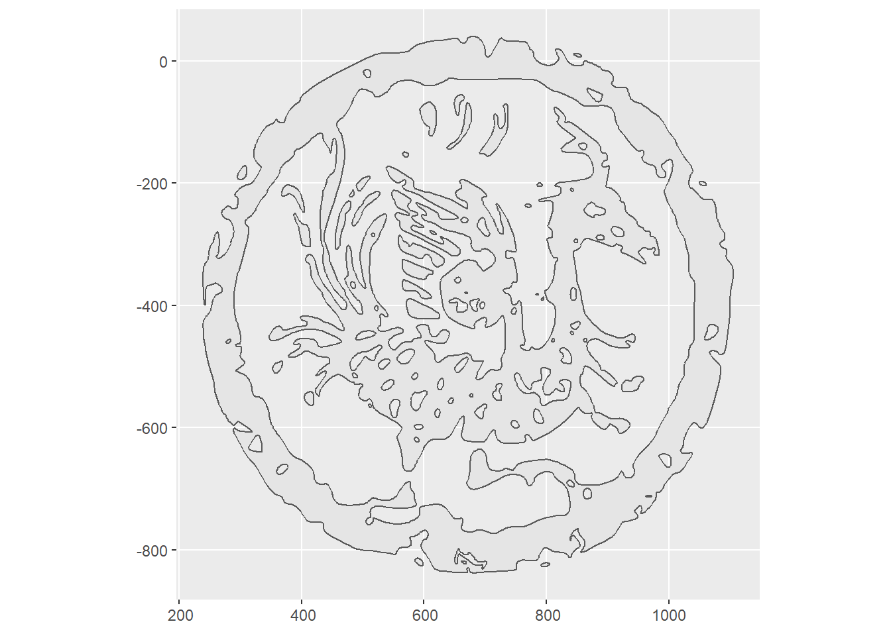

```{r setup2, include=FALSE}
knitr::opts_chunk$set(echo = TRUE)
library(tidyverse)
library(gganimate)
library(sf)
```

```{r}
#install.packages("devtools")
#devtools::install_github("thomasp85/transformr")
```

```{r}

library(gganimate)

result_1 <- st_read("./Red_Bird.shp") %>% filter(!facet %in% 
                    c(3:55, 56:60, 81)) %>% st_union() %>% st_sfc() %>% st_sf() %>% 
  mutate(facet = 1)
result_2 <- st_read("./Red_Bird.shp") %>% filter(facet %in% 
                    c(3:55, 56:60, 81)) %>% st_union() %>% st_sfc() %>% st_sf() %>% 
  mutate(facet = 2)

result <- result_1 %>% bind_rows(result_2)
result %>% ggplot() +
  geom_sf()  + 
  transition_states(
    facet,
    transition_length = 2,
    state_length = 1
  ) +
  enter_fade() + 
  exit_shrink() +
  ease_aes('sine-in-out')


anim_save("./Red_Bird.gif")

```


